# Práctica Formativa Obligatoria 2: Prompt en Agentes de IA
**Asignatura:** Desarrollo de Sistemas Web Front End
---

## 👤 Datos del Estudiante
* **Nombre y Apellido:** Medina Maira Micaela
* **Institución:** IFTS N.°29
* **Curso/División:** 2° D
* **Proyecto:** Landing page con Agentes Autónomos de IA
* **Año:** 2026
---

## 🔗 Enlaces del Proyecto
* **Repositorio GitHub:** [GitHub](https://github.com/mairammedina29/pfo2-agentes-ia)
* **Despliegue Unificado (Vercel):** [Vercel](https://pfo2-agentes-ia.vercel.app/)

---

## 1. 📝 Introducción
Este proyecto corresponde a la Práctica Formativa Obligatoria 2 (PFO 2), centrada en la investigación y aplicación de Prompts en entornos de desarrollo con Inteligencia Artificial.

El objetivo principal fue generar de manera totalmente autónoma una Landing Page a partir de una única instrucción inicial, siguiendo lineamientos de optimización de proveedores líderes como Anthropic y OpenAI. La práctica exigió no modificar manualmente el código, lo que permitió evaluar con objetividad la fidelidad y la arquitectura lógica que cada modelo de lenguaje puede producir.

Para llevar a cabo la comparativa, se seleccionaron dos agentes de software autónomos que operan bajo arquitecturas distintas:
1. **Agente 1: Cloude Code**
2. **Agente 2: OpenCode** 

Los resultados de ambas páginas creadas con IA se integraron en una **Portada de Acceso** responsiva, diseñada como interfaz base con tarjetas interactivas y un modal que muestra el prompt inicial, permitiendo visualizar de forma clara y ordenada tanto la instrucción como los resultados obtenidos.

## 2. 📂 Estructura y Organización de Carpetas
El proyecto se organizó de manera modular y siguiendo las buenas prácticas de desarrollo, separando la estructura, los estilos y la lógica de comportamiento en directorios independientes:

```text
├── index.html                       
├── css/
│   └── styles.css                  
├── js/
│   └── script.js                   
├── assets/                         
│   ├── img2.jpg                    
│   ├── img3.png                    
│   └── img4.png
│   └── imgRm/                    
├── landing-agente-1/
│   └── arcade-hud-v2-animated.html 
└── landing-agente-2/
    └── index.html                  

```
---

## 3. ⚙️ Estructura del Prompt Base 

Se diseñó un prompt estructurado mediante, asignación de rol, restricciones rigurosas de desarrollo y especificaciones de diseño. A continuación, se detalla la instrucción exacta inyectada en ambos agentes:

* **Rol**:Eres un Ingeniero de Software Senior especializado en Desarrollo Front-End UI/UX. Tu tarea es construir una Landing Page profesional, moderna, responsiva y semántica utilizando HTML5 y CSS3 puro, sin frameworks externos.

* **Objetivo**:Generar una Landing Page completa y totalmente funcional a nivel visual basada en una temática de Desarrollo Web / Prompt Engineering. Debe contar con un diseño visualmente impactante, cohesivo y adaptado a dispositivos móviles, tablets y ordenadores de escritorio.

* **Requerimeintos**
 La Landing Page debe incluir obligatoriamente las siguientes secciones organizadas semánticamente:
 1. Header: Cabecera con logotipo (placeholder) y menú de navegación funcional (enlaces internos).
 2. Hero Section: Sección principal con un título de alto impacto (CTA), subtítulo persuasivo y un botón interactivo de llamada a la acción.
 3. About Section: Bloque de descripción detallada o "Sobre Nosotros".
 4. Services Section: Cuadrícula responsiva que exponga las características o servicios principales.
 5. Testimonials Section: Bloque estético de reseñas o testimonios de clientes con avatares visuales.
 6. Contact Form: Formulario de contacto maquetado visualmente con inputs validados por HTML5 (Nombre, Email, Mensaje) y botón de envío.
 7. Footer: Pie de página completo con créditos de autoría y enlaces simulados a redes sociales.

* **Diseño del sistema**:
 - Tipografías: Utilizar fuentes modernas de Google Fonts legibles y estéticas.
 - Paleta de Colores: Definir un contraste armónico de colores (un color primario dominante, uno secundario de apoyo y un color de acento brillante para llamadas a la acción).
 - Diseño Responsivo: Implementar obligatoriamente Flexbox y CSS Grid junto con Media Queries técnicas. No se permite el desbordamiento horizontal (overflow-x).
 - Interactividad: Añadir transiciones suaves (`transition`) en botones, enlaces y tarjetas al pasar el cursor (:hover).

* **Restricciones**:
 - Todo el código debe estar modularizado y limpio. Comentarios oportunos pero no excesivos.
 - Escribe el código HTML y CSS completo de una sola vez. No resumas partes de código ni uses marcadores de posición del tipo "// tu código aquí".
 - No utilices JavaScript a menos que sea estrictamente necesario para la navegación móvil (menú hamburguesa). Prioriza soluciones CSS puros.

## 4. 📊 Análisis Comparativo visual de los Agentes Autónomos

### 🤖 Agente 1: Cloude Code
* Generó una Landing Page con estética más dinámica y fluida, llena de efectos y animaciones.
* Se destaca el uso de colores neón, ticker de novedades y tarjetas interactivas que transmiten la atmósfera arcade/cyberpunk.
* La interpretación del prompt fue muy fiel, logrando una experiencia visual rica y atractiva.

### 🤖 Agente 2:Open Code
* Produjo una Landing Page más sencilla y minimalista, con un diseño claro y funcional.
* Mantiene la estética retro, pero con menos efectos y animaciones, priorizando la legibilidad y la estructura.
* Aunque simplificó algunos elementos, cumplió correctamente con las secciones obligatorias y entregó un resultado sólido.
---

## 5. 📸 Capturas de Pantalla 

### Landing Page 1 - Generada por Claude coce
| Vista 1 | Vista 2 |
| :---: | :---: |
| 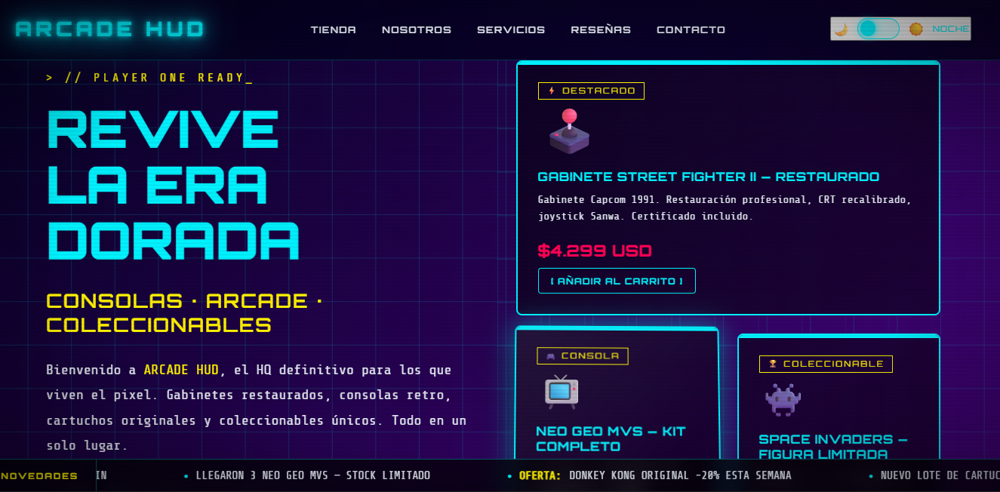 | 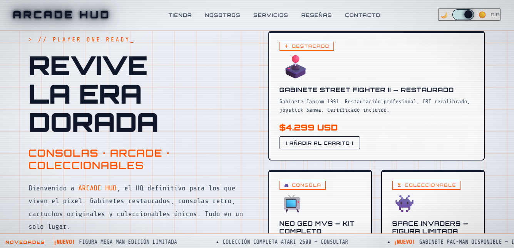 |

| Vista 3 | Vista 4 |
| :---: | :---: |
| 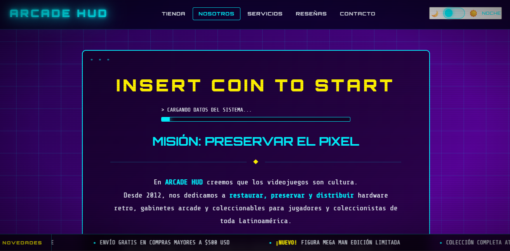 | 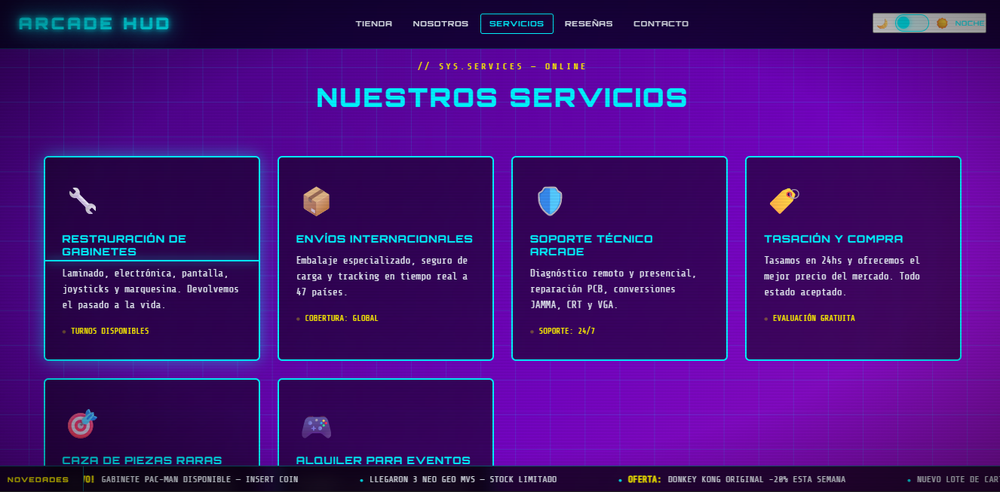 |

| Vista 5 | Vista 6 |
| :---: | :---: |
| 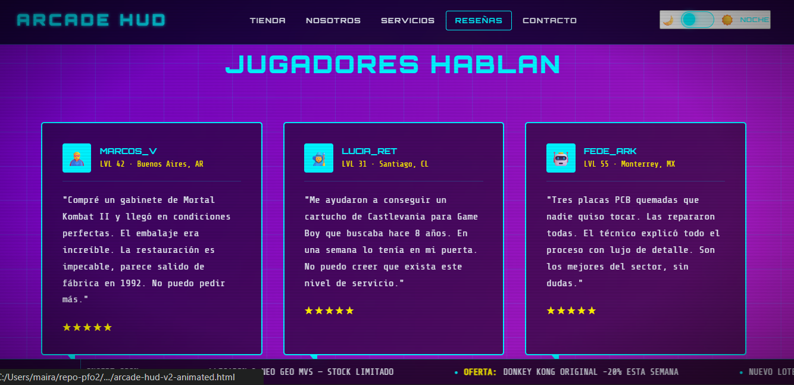 | 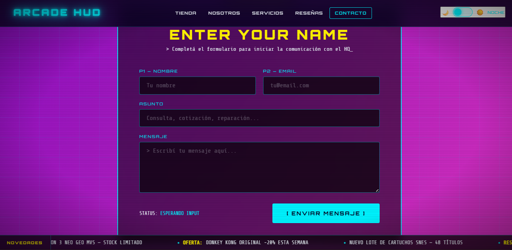 |

| Vista 7| Vista 8 |
| :---: | :---: |
| 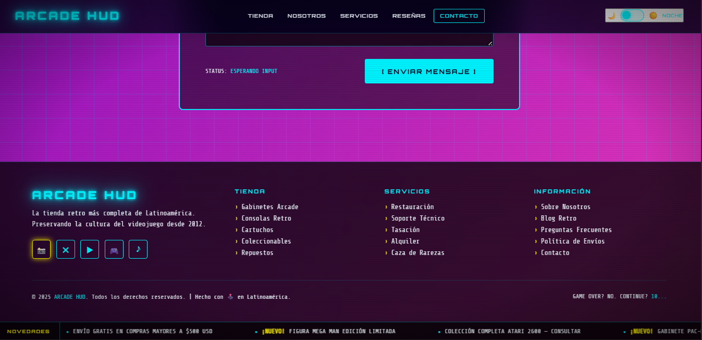 | 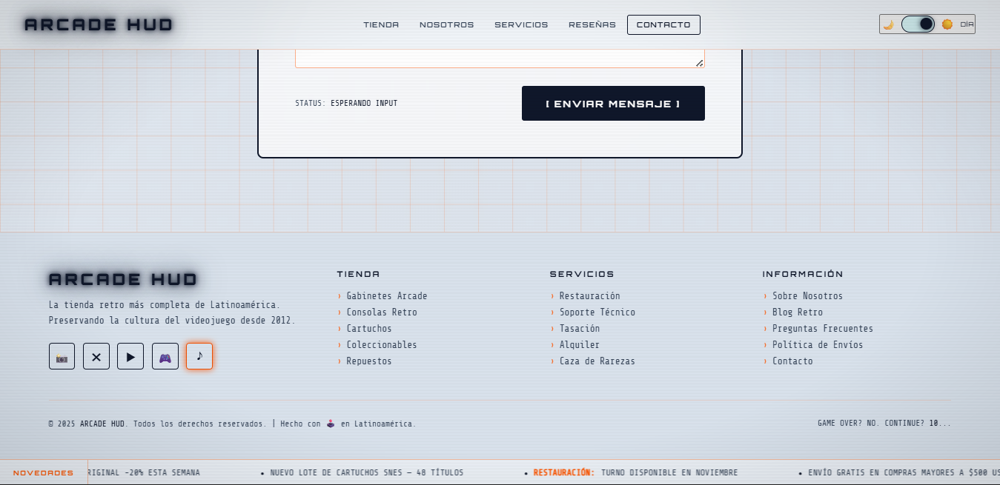 |


### Landing Page 2 - Generada por Opend Code

| Vista 1 | Vista 2 |
| :---: | :---: |
| 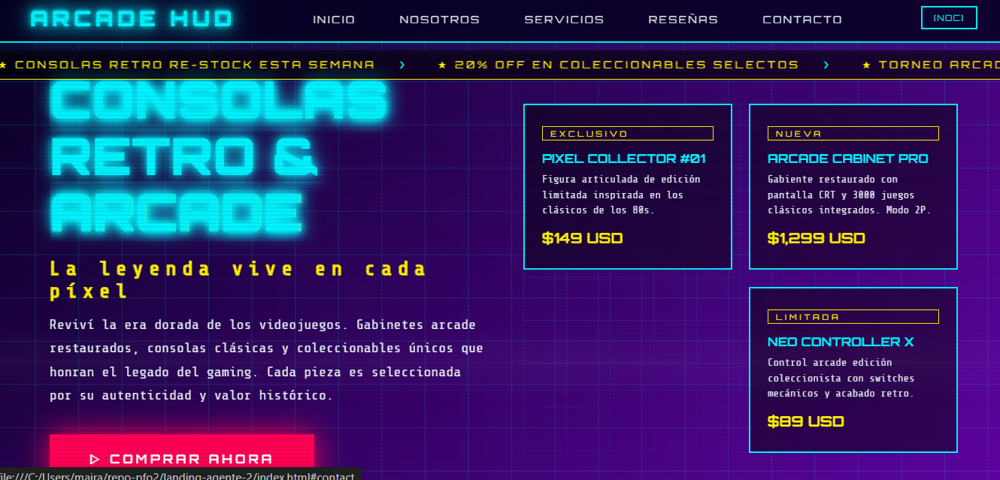 | 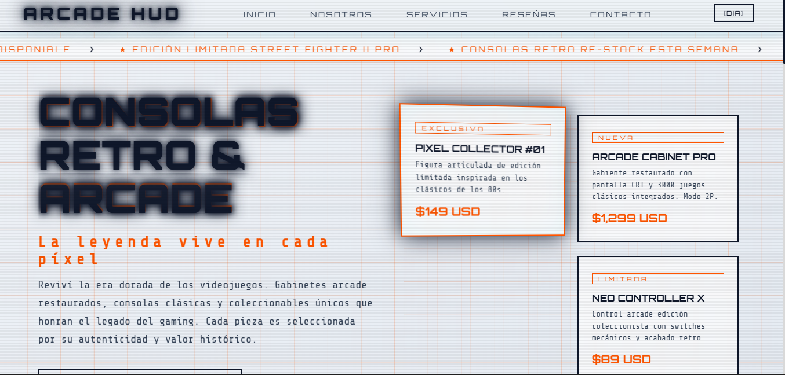 |

| Vista 3 | Vista 4 |
| :---: | :---: |
| 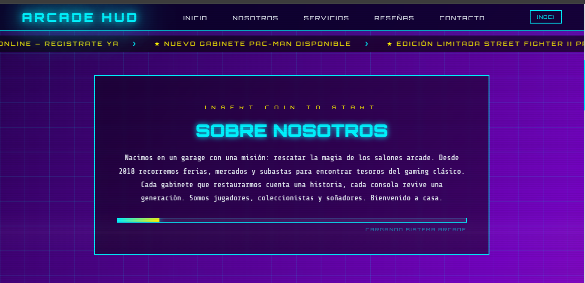 | 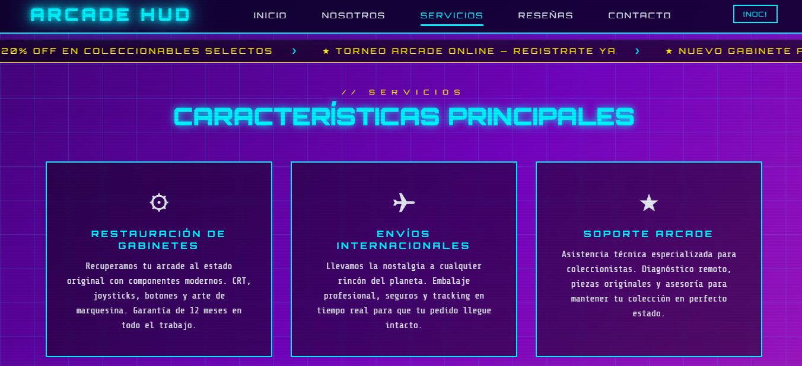 |

| Vista 5 | Vista 6 |
| :---: | :---: |
| 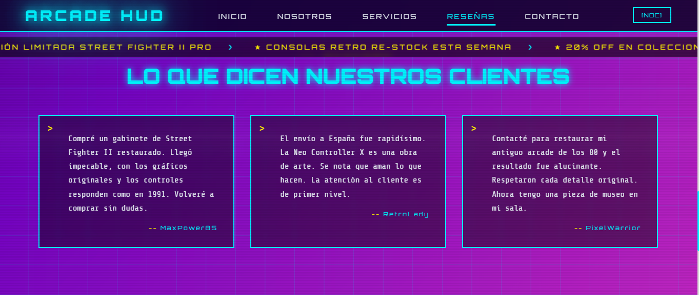 | 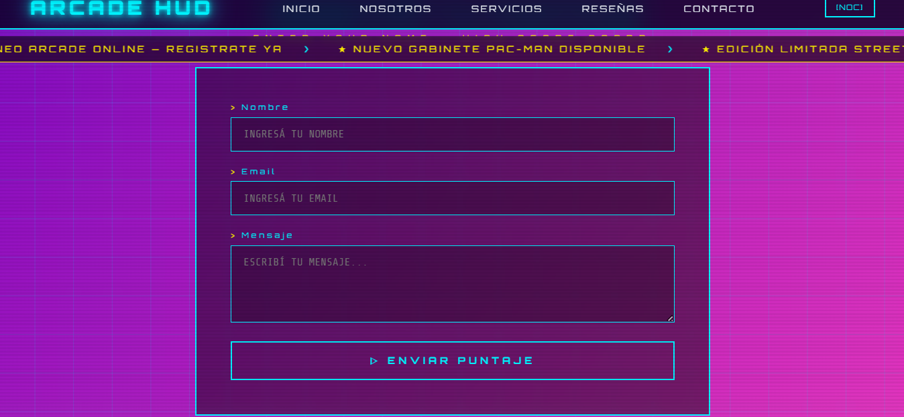 |

| Vista 7 | Vista 8 |
| :---: | :---: |
| 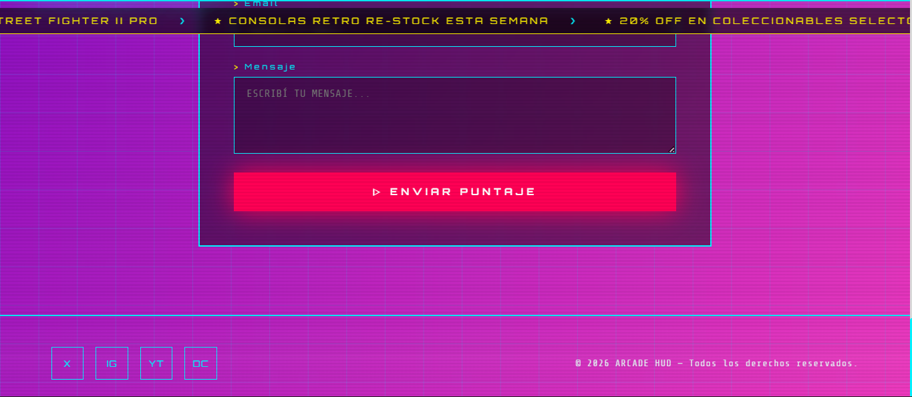 | 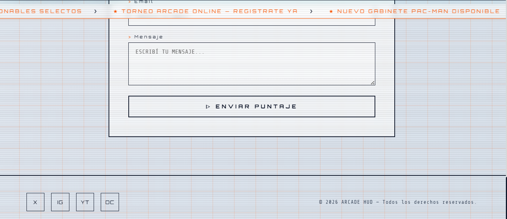 |
---

## 6. 🏁 Conclusión

La práctica demostró que un prompt bien estructurado permite a la IA generar páginas web completas y funcionales sin intervención manual. Sin embargo, más allá de la facilidad aparente, la verdadera clave está en dar una buena forma a la instrucción y en comprender que la IA es una herramienta que potencia el trabajo, pero no reemplaza la necesidad de diseñar con criterio y calidad.

En este sentido, el desarrollo asistido por IA confirma que el rol del programador se transforma: ya no se limita a escribir código, sino a definir instrucciones precisas y supervisar resultados, asegurando que las soluciones respondan a lo que se necesita y mantengan buenas prácticas de software.
